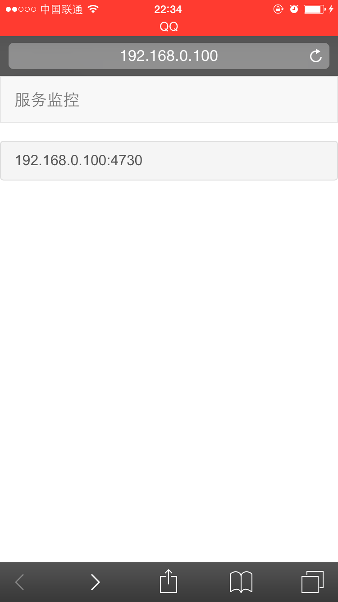
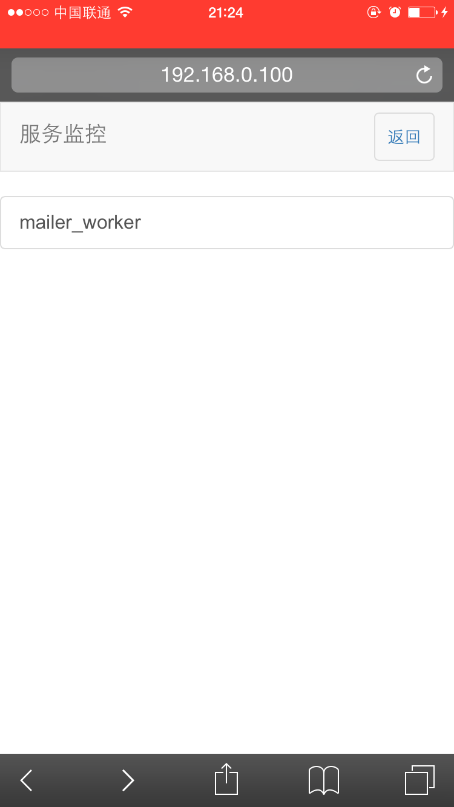
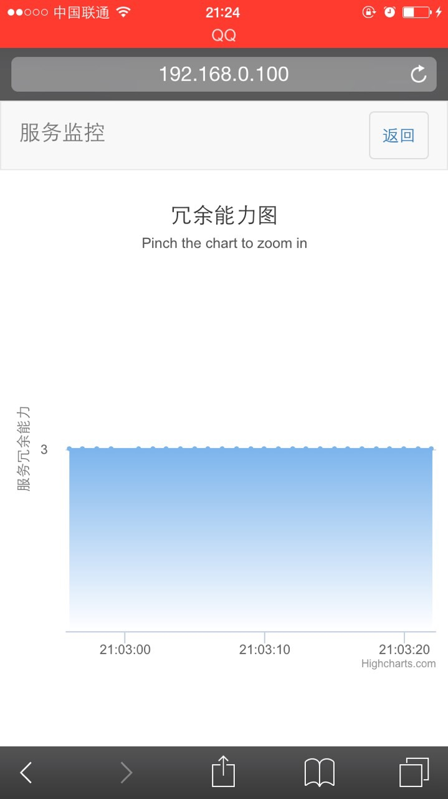

Gearman Alert
====

基于Gearman的负载预警

支持特性:

	1. 历史负载Graph图
	2. email告警
	3. 告警权限组
	4. last 1min, 5min, 15min阈值设置

Todo:

	1. ES支持
	2. 短信告警

1. 启动Web Server(可以直接用php 自带的原生Server), 指定根目录为web目录
2. 发送告警信息，依赖于gearman的分发功能，首先需要部署gearman服务端
